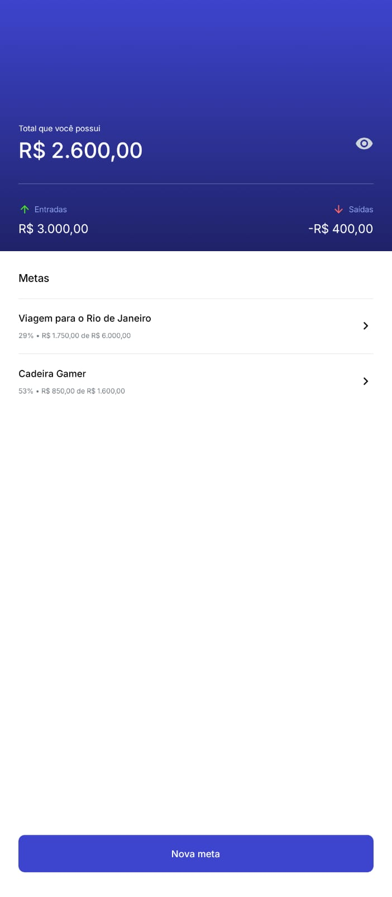
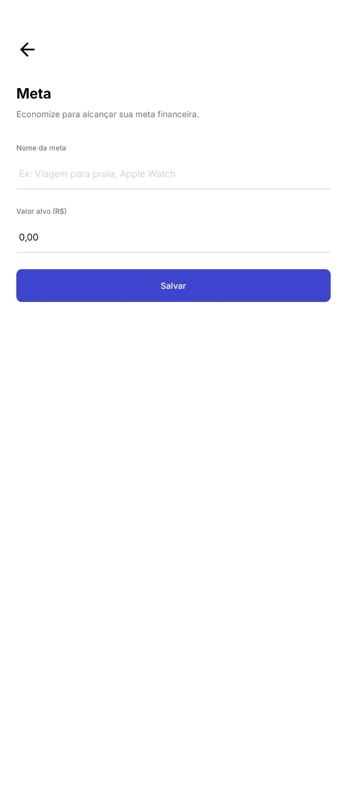
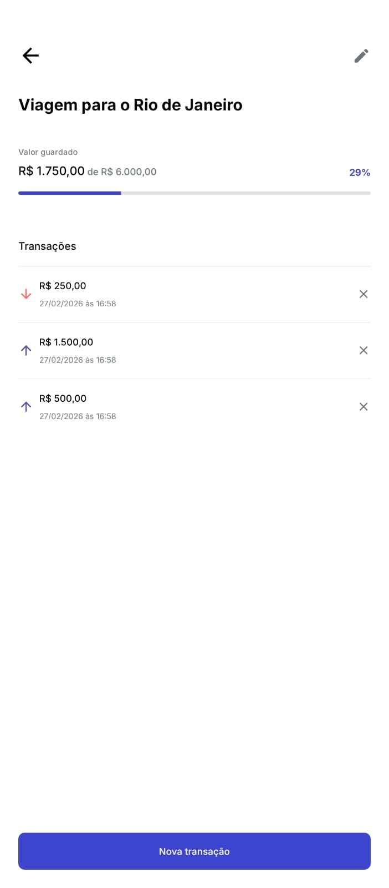
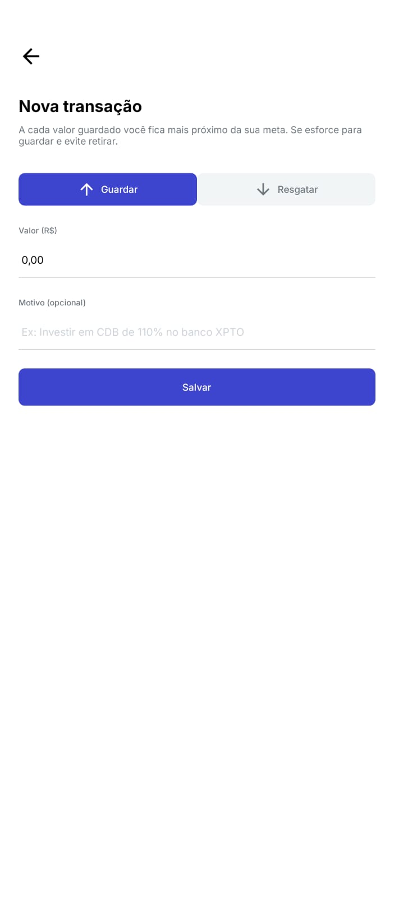

# 📱 Target

Aplicativo mobile para **organizar metas financeiras pessoais**, permitindo que o usuário crie objetivos (metas), registre depósitos e retiradas associados a cada meta e acompanhe o progresso de forma simples, visual e totalmente offline.

---

## 📌 Visão Geral

- **Nome do projeto**: Target
- **Objetivo do projeto**: Ajudar o usuário a **planejar e atingir metas financeiras específicas**, acompanhando quanto já foi guardado e quanto ainda falta para cada objetivo.
- **Público-alvo**: Pessoas que desejam **organizar suas finanças pessoais** de forma prática, especialmente quem gosta de separar o dinheiro por objetivos (ex.: viagem, eletrônicos, reserva de emergência).
- **Problema que resolve**: Dificuldade de **visualizar o progresso de cada meta**, misturando tudo em uma única conta ou planilha. O app organiza os valores por meta, registra entradas e saídas, e mostra o quanto já foi conquistado de maneira clara e motivadora.

### 🧩 Contexto de Uso

- **Ambiente**: Uso pessoal
- **Frequência**: Uso diário ou semanal, conforme o usuário realiza depósitos/retiradas das metas
- **Dispositivos alvo**: Smartphones Android e iOS
- **Modo de operação**: Totalmente **offline**, utilizando banco de dados local (SQLite)

---

## 🛠 Tecnologias Utilizadas

### ⚙️ Stack Principal

- **Framework principal**: React Native
- **Ambiente de desenvolvimento**: Expo (SDK 54)
- **Navegação**: Expo Router (baseado em React Navigation, com rotas baseadas em arquivos)
- **Linguagem**: TypeScript
- **Gerenciamento de estado**:
  - **Estado local com Hooks** (`useState`, `useEffect`, `useCallback`, `useFocusEffect`)
  - A arquitetura favorece componentes desacoplados e consultas diretas ao banco de dados via hooks específicos (`useTargetDatabase`, `useTransactionDatabase`)
- **Banco de dados / Persistência**:
  - **SQLite** via `expo-sqlite`
  - Migrações automáticas via função `migrate` para criação das tabelas `targets` e `transactions`
- **Estilização**:
  - `StyleSheet` do React Native
  - Sistema de design próprio via arquivos de tema:
    - `colors.ts` (paleta de cores)
    - `font-family.ts` (família tipográfica baseada em Inter)

### 📚 Outras bibliotecas importantes

- **`expo-router`**: Organização de rotas a partir da estrutura de arquivos em `src/app`
- **`expo-sqlite`**: Banco de dados local para persistência de metas e transações
- **`@expo-google-fonts/inter`**: Fonte Inter (Regular, Medium, Bold) para tipografia consistente
- **`expo-linear-gradient`**: Gradientes no cabeçalho da tela inicial
- **`@expo/vector-icons`**: Ícones (Material Icons) para reforço visual
- **`dayjs`**: Formatação de datas das transações
- **`react-native-currency-input`**: Input de valores monetários com máscara em tempo real
- **`expo-status-bar`, `expo-constants`, `expo-splash-screen`, `expo-web-browser`**: Utilidades do ecossistema Expo

---

## 📱 Funcionalidades Principais

- **Cadastro de metas financeiras**
  - Criação de metas com **nome** e **valor alvo (R$)**.
  - Edição e remoção de metas existentes.

- **Registro de transações por meta**
  - Criação de transações do tipo **entrada (depósito)** ou **saída (retirada)**.
  - Campo opcional de **observação/motivo** por transação.
  - Remoção de transações específicas.

- **Cálculo automático de progresso da meta**
  - Cálculo do **valor atual guardado** por meta.
  - Exibição de **percentual de progresso** e barra de progresso visual.

- **Resumo financeiro global**
  - Cálculo de **total de entradas**, **total de saídas** e **saldo total** em todas as metas.
  - Opção de **ocultar/mostrar valores** no cabeçalho (visibilidade do saldo).

- **Persistência local dos dados**
  - Todos os dados são salvos em **SQLite**, permitindo uso offline.
  - Remoção de uma meta apaga automaticamente suas transações (via `ON DELETE CASCADE`).

---

## 📲 Telas do Aplicativo

### 🏠 Tela Inicial – Lista de Metas (`src/app/index.tsx`)

- **Nome da tela**: Home / Metas
- **Objetivo**:  
  Exibir o **resumo financeiro global** (entradas, saídas, total) e listar todas as metas financeiras do usuário em ordem de maior valor guardado.

  

- **Principais componentes**:
  - `HomeHeader`: Cabeçalho com:
    - Total que o usuário possui (com opção de ocultar/mostrar valores)
    - Resumo de **Entradas** e **Saídas**
  - `List`: Lista de metas com título e mensagem para lista vazia
  - `Target`: Card de meta exibindo:
    - Nome da meta
    - Valor atual guardado
    - Valor alvo
    - Percentual atingido
  - `Button`: Botão **"Nova meta"** para criação de uma nova meta

- **Fluxo de navegação**:
  - **Vem de**: Tela inicial do app (rota `/`)
  - **Vai para**:
    - `/in-progress/[id]` ao tocar em uma meta (detalhes da meta e transações)
    - `/target` ao tocar em **"Nova meta"**

- **Estados importantes**:
  - `isFetching`: controla exibição de `Loading` enquanto os dados são carregados
  - `targets`: lista de metas formatadas para exibição
  - `summary`: objeto com:
    - `input` (entradas)
    - `output` (saídas)
    - `total` (saldo geral)

---

### 🎯 Tela de Meta – Criar/Editar Meta (`src/app/target.tsx`)

- **Nome da tela**: Meta
- **Objetivo**:  
  Permitir que o usuário **crie uma nova meta** ou **edite/remova** uma meta existente, definindo nome e valor objetivo.

  

- **Principais componentes**:
  - `PageHeader`:
    - Título: **"Meta"**
    - Subtítulo: “Economize para alcançar sua meta financeira.”
    - Botão de remoção (ícone `delete`) quando em modo edição
  - `Input`: Campo **"Nome da meta"**
  - `CurrencyInput`: Campo **"Valor alvo (R$)"**
  - `Button`: Botão **"Salvar"**

- **Fluxo de navegação**:
  - **Vem de**:
    - `/` (nova meta, sem `id`)
    - `/in-progress/[id]` (edição, com `?id=` na rota)
  - **Vai para**:
    - `router.back()` após salvar (criação ou atualização)
    - `router.replace("/")` após remoção da meta

- **Estados importantes**:
  - `name`: nome da meta
  - `amount`: valor alvo em número
  - `isProcessing`: controle de loading do botão **"Salvar"**
  - Regras de validação:
    - Nome não pode ser vazio
    - Valor deve ser **maior que zero**

---

### 📊 Tela de Meta em Progresso – Detalhes e Transações (`src/app/in-progress/[id].tsx`)

- **Nome da tela**: Detalhes da Meta / Progresso
- **Objetivo**:  
  Exibir os **detalhes da meta selecionada**, mostrar o **progresso atual** e listar todas as **transações associadas** (entradas e saídas).

  

- **Principais componentes**:
  - `PageHeader`:
    - Título com o **nome da meta**
    - Botão de edição (ícone `edit`) que leva para `/target?id=...`
  - `Progress`:
    - Exibe:
      - Valor guardado atual (`current`)
      - Valor alvo (`target`)
      - Percentual de conclusão (`percentage`)
    - Mostra também uma **barra de progresso** preenchida proporcionalmente
  - `List`:
    - Lista de transações com:
      - Data formatada (`dayjs`)
      - Valor (positivo para entrada, negativo como saída – exibido sem o sinal, mas com tipo visual)
      - Descrição/observação
    - `Transaction`: componente de item com botão de remoção
  - `Button`: Botão **"Nova transação"** para criar lançamento vinculado à meta

- **Fluxo de navegação**:
  - **Vem de**: `/` ao selecionar uma meta
  - **Vai para**:
    - `/target?id=[id]` ao editar meta
    - `/transactions/[id]` ao criar nova transação

- **Estados importantes**:
  - `isFetching`: controla exibição do `Loading`
  - `details`: objeto com:
    - `name` (nome da meta)
    - `current` (valor atual guardado)
    - `target` (valor alvo)
    - `percentage` (percentual alcançado)
  - `transactions`: lista de transações formatadas (com data, valor e tipo)

---

### 💸 Tela de Nova Transação (`src/app/transactions/[id].tsx`)

- **Nome da tela**: Nova transação
- **Objetivo**:  
  Registrar uma **entrada** (depósito) ou **saída** (retirada) de valor para uma meta específica.

  

- **Principais componentes**:
  - `PageHeader`:
    - Título: **"Nova transação"**
    - Subtítulo motivacional explicando a importância de guardar dinheiro
  - `TransactionType`:
    - Seleção entre **Entrada** ou **Saída** (`TransactionTypes.Input` / `TransactionTypes.Output`)
  - `CurrencyInput`:
    - Campo para o **valor (R$)** da transação
  - `Input`:
    - Campo **"Motivo (opcional)"**
  - `Button`:
    - Botão **"Salvar"**, com loading controlado por `isCreating`

- **Fluxo de navegação**:
  - **Vem de**: `/in-progress/[id]` ao tocar em **"Nova transação"**
  - **Vai para**:
    - `router.back()` após criação bem-sucedida

- **Estados importantes**:
  - `amount`: valor numérico da transação
  - `observation`: texto opcional com o motivo
  - `type`: tipo da transação (`input` ou `output`)
  - `isCreating`: controle de loading ao salvar
  - Regras:
    - Valor deve ser **maior que 0 (zero)**
    - Saídas são salvas como valor **negativo** no banco (`amount * -1`)

---

## ⚙️ Estrutura do Projeto

- **`src/app`**:  
  Contém as **rotas e telas** do aplicativo, organizadas de acordo com a convenção do **Expo Router** (cada arquivo representa uma rota).

- **`src/components`**:  
  Componentes de interface reutilizáveis (botões, inputs, headers, listas, cards de meta, cards de transação, etc.).

- **`src/database`**:  
  Camada de acesso a dados:
  - `migrate.ts`: criação/atualização das tabelas no banco SQLite.
  - `use-target-database.ts`: operações relacionadas às **metas** (CRUD, listagem por valor guardado, detalhes).
  - `use-transaction-database.ts`: operações relacionadas às **transações** (criação, remoção, resumo, listagem por meta).

- **`src/theme`**:  
  Definição de **paleta de cores** e **família de fontes**, centralizando o tema visual da aplicação.

- **`src/utils`**:  
  Funções auxiliares, como:
  - `number-to-currency`: formata valores numéricos para o padrão `pt-BR` (`R$`).
  - `transaction-types`: enumeração de tipos de transações.

---

## 🔐 Regras de Negócio

- **Metas**:
  - Uma meta precisa ter:
    - **Nome obrigatório** (não pode ser string vazia).
    - **Valor alvo maior que 0**.
  - Metas podem ser **criadas, editadas e removidas**.
  - Ao remover uma meta, todas as transações associadas são removidas automaticamente (`ON DELETE CASCADE`).

- **Transações**:
  - Uma transação sempre pertence a **uma meta** (`target_id` obrigatório).
  - O valor da transação deve ser **maior que 0** (validação na tela de criação).
  - Regra de sinal:
    - **Entrada (Input)**: valor salvo como positivo.
    - **Saída (Output)**: valor salvo como **negativo**.
  - A descrição (`observation`) é opcional, mas armazenada para histórico.

- **Resumo global**:
  - `input`: soma de todas as transações com `amount > 0`.
  - `output`: soma de todas as transações com `amount < 0`.
  - `total`: calculado a partir de `input + output`.

- **Progresso da meta**:
  - `current`: soma das transações associadas à meta.
  - `percentage`: `(current / amount) * 100`, limitado a 0 quando não há transações.
  - Metas são listadas na tela inicial ordenadas pelo **valor atual guardado** de forma decrescente.

---

## 🌐 Integrações Externas

Atualmente, o aplicativo **não consome APIs externas**.

Toda a persistência e cálculo são feitos **localmente** usando `expo-sqlite`. Isso traz as seguintes vantagens:

- Funcionamento **offline-first**.
- Maior privacidade, já que os dados financeiros ficam armazenados apenas no dispositivo.
- Menor complexidade de infraestrutura (sem backend obrigatório).

Uma camada de serviços de API pode ser adicionada futuramente para sincronização em nuvem.

---

## 🚀 Como Rodar o Projeto

### ✅ Pré-requisitos

- **Node.js**: versão recomendada >= 18
- **npm** (ou outro gerenciador compatível, o projeto está configurado com `npm` via `package-lock.json`)
- **Expo CLI** (via `npx expo` ou global, opcional)
- **Ambiente Android/iOS**:
  - Android Studio + emulador configurado, ou
  - Xcode (para desenvolvimento em iOS em macOS), ou
  - Dispositivo físico com o app Expo Go instalado.

### 📥 Clonagem do repositório

git clone https://github.com/LElTEDEV/target.git
cd target### 📦 Instalação de dependências

npm install### ▶️ Rodar no Android

Com emulador Android aberto ou dispositivo físico conectado:

npm run android

# e depois escolher a opção "a" para Android

### 🍎 Rodar no iOS (macOS)

Com simulador iOS aberto ou dispositivo físico configurado:

npm run ios

# e depois escolher a opção "i" para iOS

### 🔑 Variáveis de ambiente

No estado atual do projeto:

- Não há uso de variáveis de ambiente sensíveis (como chaves de API).
- Caso seja necessário adicionar integrações futuras, recomenda-se utilizar:
  - Arquivos `.env` com suporte do Expo
  - Tipagens em `expo-env.d.ts` para garantir segurança de tipos.

---

## 📦 Scripts Disponíveis (`package.json`)

- **`npm start`**:  
  Inicia o servidor de desenvolvimento do Expo (Metro bundler).

- **`npm run android`**:  
  Executa `expo run:android`, construindo e abrindo o app no emulador/dispositivo Android.

- **`npm run ios`**:  
  Executa `expo run:ios`, construindo e abrindo o app no simulador/dispositivo iOS.

---

## 🧠 Decisões Técnicas

- **Expo + Expo Router**:  
  Escolhidos para:
  - Agilidade de configuração e desenvolvimento.
  - Hot reload confiável e ferramentas de debug integradas.
  - Navegação baseada em arquivos, que simplifica a organização das rotas.

- **TypeScript**:  
  Garante maior segurança na manipulação de dados financeiros (tipagem de valores, IDs, modelos de metas e transações) e melhora a manutenibilidade do projeto.

- **SQLite (expo-sqlite)**:
  - Adequado para cenários de **uso offline** com necessidade de **relacionamentos** (`targets` x `transactions`).
  - Permite consultas agregadas (sum, group by) e regras de integridade (foreign keys com `ON DELETE CASCADE`).

- **Estado local com Hooks ao invés de store global complexo**:
  - A complexidade do domínio é concentrada em poucas telas.
  - Acesso aos dados é feito diretamente por hooks de banco (`useTargetDatabase`, `useTransactionDatabase`), reduzindo necessidade de Redux/Zustand.
  - Facilita entendimento e onboarding de novos desenvolvedores.

- **StyleSheet + tema customizado**:
  - Melhor performance que algumas libs de css-in-js em cenários simples.
  - Controle total sobre o design system (`colors`, `font-family`) sem dependência de frameworks de UI pesados.

---

## 🛣 Melhorias Futuras

- **Sincronização em nuvem**:
  - Autenticação de usuário (login) e backup das metas e transações em servidor remoto.

- **Categorias e tags para metas e transações**:
  - Permitir agrupar metas por categoria (ex.: lazer, estudos, investimentos).
  - Filtrar e gerar relatórios mais detalhados.

- **Gráficos e dashboards**:
  - Visualizar evolução das metas ao longo do tempo.
  - Dashboard com indicadores principais (últimas transações, metas quase concluídas, etc.).

- **Notificações e lembretes**:
  - Alertar o usuário para guardar dinheiro em determinada meta em datas pré-configuradas.

- **Multi-moeda e internacionalização (i18n)**:
  - Suporte a diferentes moedas além de BRL.
  - Tradução para outros idiomas além de português.
